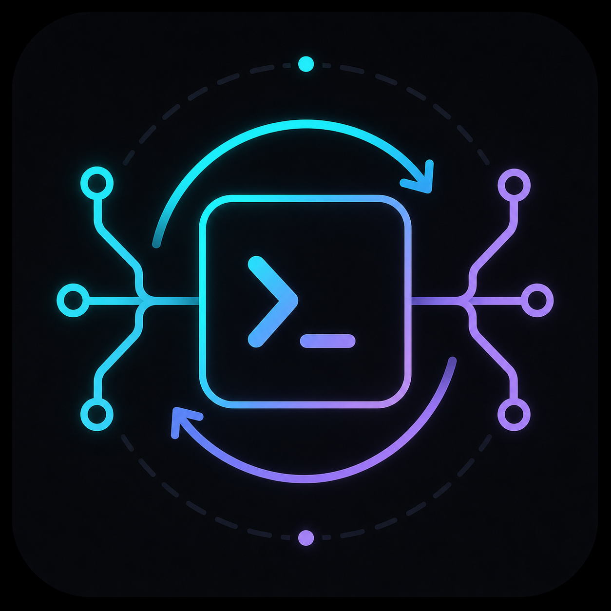

<a id="readme-top"></a>


<div align="center">
  
  <h1>PseudoClaude</h1>
  <p><strong>用 Go 编写的 Claude Code 风格终端 AI Agent。</strong></p>
  <p>
    <a href="./README.md">English</a>
    ·
    <a href="https://github.com/LulietLyan/PseudoClaude/issues/new?labels=bug">反馈问题</a>
    ·
    <a href="https://github.com/LulietLyan/PseudoClaude/issues/new?labels=enhancement">功能建议</a>
  </p>
</div>

<p align="center">
  
  
  
  
  
  
</p>

<p align="center">
  <a href="https://www.sysu.edu.cn/"></a>
  &nbsp;&nbsp;
  <a href="https://nscc-gz.cn/"></a>
</p>


## 项目简介

PseudoClaude 是一个面向软件工程工作的本地终端 AI Agent。它把大模型、本地工具、权限系统、长期记忆、MCP Server、Skill、Hook、后台任务和子 Agent 委派整合进一个交互式 TUI。

项目关注“可控的自主执行”：模型可以读取文件、编辑代码、搜索工作区、运行验证命令、调用外部 MCP 工具，并持续推进多步骤任务；同时，权限检查和工作区边界会让高风险操作保持可见、可审查。

<p align="right"><a href="#readme-top">返回顶部</a></p>

## 核心能力

<table>
  <tr>
    <td><strong>终端 Agent Loop</strong></td>
    <td>流式输出模型内容，执行工具调用，把结果回灌给模型，并持续推进直到完成或触发停止条件。</td>
  </tr>
  <tr>
    <td><strong>多 Provider 接入</strong></td>
    <td>支持 Anthropic 与 OpenAI 兼容协议，也支持自定义 <code>base_url</code> 端点。</td>
  </tr>
  <tr>
    <td><strong>本地工程工具</strong></td>
    <td>内置文件读写编辑、代码搜索、文件 glob 和命令执行工具。</td>
  </tr>
  <tr>
    <td><strong>权限系统</strong></td>
    <td>组合权限模式、路径沙箱、危险命令检查、策略文件和交互式审批。</td>
  </tr>
  <tr>
    <td><strong>MCP 集成</strong></td>
    <td>连接 stdio 与 Streamable HTTP MCP Server，并把远端工具注册给 Agent 使用。</td>
  </tr>
  <tr>
    <td><strong>上下文与记忆</strong></td>
    <td>大型工具结果可落盘，支持上下文压缩、JSONL 会话存档、项目级和用户级记忆。</td>
  </tr>
  <tr>
    <td><strong>Skills、Hooks 与 Slash 命令</strong></td>
    <td>加载可复用 Skill、生命周期 Hook，以及 <code>/status</code>、<code>/compact</code>、<code>/agents</code>、<code>/worktree</code> 等本地命令。</td>
  </tr>
  <tr>
    <td><strong>Worktree 隔离子 Agent</strong></td>
    <td>把聚焦任务委派给子 Agent，并可让它们在独立 Git worktree 中运行，避免污染主工作区。</td>
  </tr>
</table>

<p align="right"><a href="#readme-top">返回顶部</a></p>

## 快速开始

### 环境要求

- Go `1.26.4` 或与 `go.mod` 兼容的版本
- 一个 Anthropic 或 OpenAI API 兼容的模型服务
- 可选：Node.js / `npx`，用于运行部分 MCP Server

### 构建

```bash
git clone https://github.com/LulietLyan/PseudoClaude.git
cd PseudoClaude
go mod download
go build -o PseudoClaude ./cmd/PseudoClaude
```

### 配置

PseudoClaude 默认读取项目根目录下的 `.PseudoClaude/config.yaml`。最小 Provider 配置示例：

```yaml
providers:
  - name: OpenAI
    protocol: openai
    base_url: https://api.openai.com/v1
    api_key: sk-...
    model: gpt-5
    thinking: false
    context_window: 128000

  - name: Claude
    protocol: anthropic
    api_key: sk-ant-...
    model: claude-sonnet-4-5
    thinking: true
    context_window: 200000
```

请不要把真实 API Key 提交到版本控制。适合本地保存的 `.PseudoClaude/` 配置文件已经按用途加入忽略规则。

### 启动

```bash
./PseudoClaude
```

也可以直接用 Go 运行：

```bash
go run ./cmd/PseudoClaude
```

如果配置了多个 provider，先在 TUI 中选择模型。进入会话后直接输入任务即可。`Alt+Enter` 输入多行，`Shift+Tab` 切换权限模式。

<p align="right"><a href="#readme-top">返回顶部</a></p>

## 配置说明

### Provider 字段

| 字段 | 必填 | 说明 |
| --- | --- | --- |
| `name` | 是 | TUI 中展示的 Provider 名称。 |
| `protocol` | 是 | `anthropic` 或 `openai`。 |
| `base_url` | 否 | 自定义兼容 API 端点。 |
| `api_key` | 是 | 模型服务密钥。 |
| `model` | 是 | 模型名称。 |
| `thinking` | 否 | 在支持的模型上启用扩展思考。 |
| `context_window` | 否 | 上下文窗口大小，未配置时使用协议默认值。 |

### MCP Server

MCP Server 可以写在同一个配置文件里：

```yaml
mcp_servers:
  context7:
    type: stdio
    command: npx
    args:
      - -y
      - "@upstash/context7-mcp"
```

单个 MCP Server 连接失败不会影响内置工具和其它 MCP Server。

### 权限规则

权限设置支持用户级、项目级和本地级多层加载。共享项目策略通常写在 `.PseudoClaude/permissions.yaml`，个人本地授权写在 `.PseudoClaude/permissions.local.yaml`。

```yaml
defaultMode: default

permissions:
  allow:
    - Read
    - Glob(internal/**)
    - Grep(internal/**)
    - Bash(go test ./...)
  deny:
    - Bash(git push *)
    - Write(.PseudoClaude/config.yaml)
```

可用模式包括 `strict`、`default`、`acceptEdits` 和 `bypassPermissions`。路径沙箱和危险命令检查优先于用户规则。

### 项目输入

| 路径 | 用途 |
| --- | --- |
| `PSEUDOCLAUDE.md` | 项目根指令。 |
| `.PseudoClaude/PSEUDOCLAUDE.md` | 项目本地指令。 |
| `~/.PseudoClaude/PSEUDOCLAUDE.md` | 用户级通用指令。 |
| `.PseudoClaude/memory/` | 项目级长期记忆。 |
| `~/.PseudoClaude/memory/` | 用户级长期记忆。 |
| `.PseudoClaude/skills/` / `~/.PseudoClaude/skills/` | 项目级或用户级 Skill。 |
| `.PseudoClaude/agents/` / `~/.PseudoClaude/agents/` | 自定义子 Agent 角色。 |
| `.PseudoClaude/hooks.yaml` / `~/.PseudoClaude/hooks.yaml` | 生命周期 Hook 规则。 |

指令文件支持独占行 `@include <relative_path>`，用于把同目录附近的参考材料展开进提示词。

<p align="right"><a href="#readme-top">返回顶部</a></p>

## 常用命令

| 命令 | 说明 |
| --- | --- |
| `/help` | 查看 slash 命令。 |
| `/status` | 查看工作模式、权限模式、模型、token、会话和当前工作区。 |
| `/session` | 查看当前会话元信息。 |
| `/memory` | 刷新并展示长期记忆摘要。 |
| `/permission` | 查看当前权限模式。 |
| `/plan` | 切换到偏只读的计划模式。 |
| `/do` | 切回默认执行模式。 |
| `/compact` | 手动压缩当前上下文。 |
| `/clear` | 清空当前可见对话区域，保留模型上下文。 |
| `/skill [reload]` | 查看或刷新可用 Skill。 |
| `/hooks` | 查看已加载生命周期 Hook。 |
| `/agents [reload\|name]` | 查看、刷新或检查子 Agent 角色。 |
| `/worktree ...` | 创建、列出、进入、退出或删除托管 Git worktree。 |

已加载的 Skill 也可以注册自己的 slash 命令，例如 `/<skill-name>`。

<p align="right"><a href="#readme-top">返回顶部</a></p>

## Worktree 隔离子 Agent

子 Agent 可以运行在独立 Git worktree 里。适合委派可能编辑文件、运行测试或提交修改的任务，同时保持主工作区稳定。

可以在子 Agent 定义中启用：

```yaml
---
name: isolated-worker
description: Runs in an isolated Git worktree.
isolation: worktree
---
You are a focused implementation agent.
```

也可以在 Agent 工具调用里传入：

```json
{
  "subagent_type": "general-purpose",
  "description": "Update one file in isolation",
  "prompt": "Edit the target file and commit the result.",
  "isolation": "worktree"
}
```

隔离子 Agent 完成后，干净的临时 worktree 会自动删除；存在受保护变更或提交时会保留，方便后续审查。

<p align="right"><a href="#readme-top">返回顶部</a></p>

## 项目结构

```text
cmd/PseudoClaude/       应用入口与启动装配
internal/agent/         Agent Loop、子 Agent 工具与运行事件
internal/command/       Slash 命令解析、分发与格式化
internal/compact/       工具结果落盘与上下文压缩
internal/config/        配置加载与校验
internal/conversation/  对话历史辅助
internal/hook/          生命周期 Hook 与提示词注入
internal/instructions/  指令加载与 include 展开
internal/llm/           Anthropic 与 OpenAI 协议适配
internal/mcp/           MCP Server 连接与工具适配
internal/memory/        项目级和用户级记忆
internal/permission/    权限规则、沙箱和安全检查
internal/session/       JSONL 会话存档与恢复
internal/skills/        Skill 解析、加载、渲染与安装逻辑
internal/subagent/      子 Agent 定义、目录和 fork 上下文
internal/task/          后台任务生命周期与任务工具
internal/tools/         内置工具注册与执行
internal/tui/           Bubble Tea 终端界面
internal/worktree/      托管 Git worktree 生命周期
image/                  README 图片和视觉资产
```

<p align="right"><a href="#readme-top">返回顶部</a></p>

## 开发

运行完整验证：

```bash
go test ./...
go vet ./...
go build ./...
```

构建本地二进制：

```bash
go build -o ./PseudoClaude ./cmd/PseudoClaude
```

<p align="right"><a href="#readme-top">返回顶部</a></p>

## 许可协议

本项目使用 [`LICENSE`](./LICENSE) 中包含的许可协议发布。


