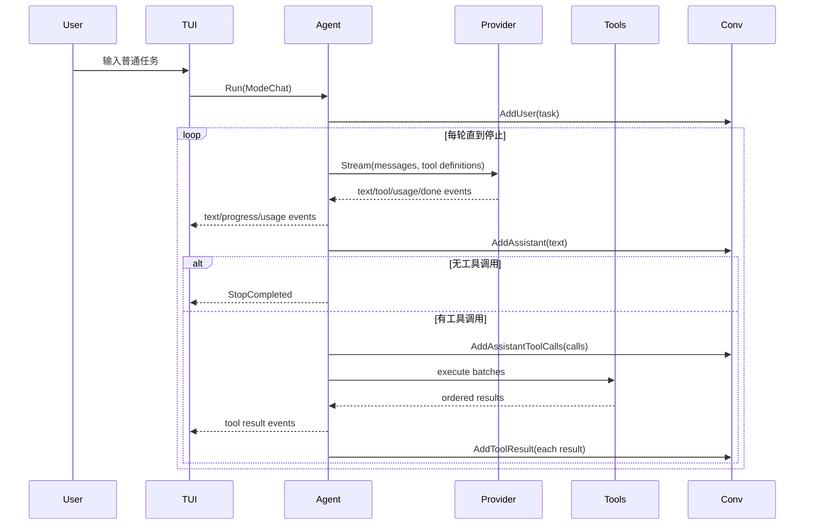
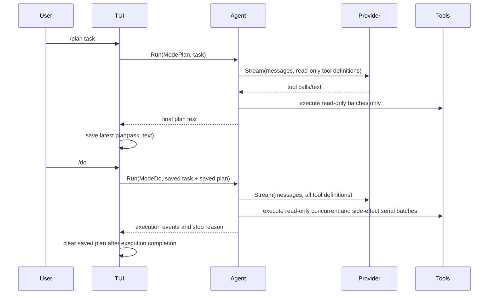

# Agent Loop Plan

## 技术栈

- 语言：Go
- 并发模型：`context.Context`、goroutine、channel、`sync.WaitGroup`
- LLM 通信：沿用现有 `internal/llm` provider 抽象与 Anthropic/OpenAI SDK
- 工具执行：沿用 `internal/tools` 注册中心与结构化结果
- 会话历史：沿用并扩展 `internal/conversation`
- TUI：沿用 bubbletea 事件循环；TUI 消费 Agent 事件，不再直接执行工具
- 测试：Go 单元测试，使用 fake provider、fake tool、事件消费者验证循环行为

## 架构概览

本阶段新增 `agent` 模块作为“用户提交 → 多轮模型推理与工具执行 → 停止”的唯一编排层。TUI 不再直接读取 provider 流、执行工具或拼装工具结果，而是创建一次 Agent Run，并消费 Agent 事件更新界面。

1. `agent` 模块负责 ReAct 循环。它持有 provider、工具注册中心、工具环境、循环配置和对话历史引用；每轮请求模型，使用流式收集器同时发布文本增量和收集完整响应；当一轮结束后，根据收集到的工具调用决定是否执行工具并继续下一轮。
2. `agent` 事件流负责解耦。所有文本、工具调用、工具结果、用量、进度、停止和错误都通过 `Event` 输出。TUI、测试消费者或未来其他界面只依赖这套事件。
3. `llm` 模块继续隐藏 Anthropic/OpenAI 协议差异，但需要扩展流式事件表达：一轮响应可以产生多个工具调用、完整助手文本和 token 用量。provider 只负责“报告模型输出”，不负责工具执行和循环。
4. `tools` 模块新增工具安全性元数据和只读过滤能力。Agent 根据工具安全性把同一轮工具调用切成并发只读批次和串行副作用批次。Plan Mode 使用只读工具定义集，阻止副作用工具进入模型可见集合。
5. `conversation` 模块保留消息顺序和 provider 需要的工具历史。Agent 负责按顺序追加用户消息、assistant 文本、assistant 工具调用和 tool result。
6. `tui` 模块新增 `/plan` 与 `/do` 命令解析。`/plan` 启动只读 Agent Run 并保存最近成功计划；`/do` 读取该计划和原任务，启动全工具 Agent Run；普通输入启动全工具 Agent Run。

## 核心数据结构

### `agent.Runner`

```go
type Runner struct {
    Provider llm.Provider
    Registry *tools.Registry
    Env      tools.Env
    Config   Config
}
```

职责：
- 启动一次 Agent Run，并返回只读事件 channel。
- 每次 Run 独立维护轮次、停止原因、未知工具连续计数和流式收集状态。
- 不持有 TUI 状态，不直接打印任何内容。

### `agent.Config`

```go
type Config struct {
    MaxIterations       int
    MaxUnknownToolCalls int
}
```

职责：
- 提供循环兜底限制。
- `DefaultConfig()` 返回适合终端交互的保守默认值，例如最大 10 轮、连续未知工具 2 次。

### `agent.Request`

```go
type Request struct {
    Mode         Mode
    UserText     string
    PlanTask     string
    PlanText     string
    Conversation *conversation.Conversation
}
```

职责：
- 表达一次用户提交的运行模式和输入。
- 普通模式使用 `UserText`。
- 计划模式使用 `PlanTask` 并将其作为用户目标追加到历史。
- 执行模式使用 `PlanTask + PlanText` 生成执行提示，切换回全工具。

### `agent.Mode`

```go
type Mode string

const (
    ModeChat Mode = "chat"
    ModePlan Mode = "plan"
    ModeDo   Mode = "do"
)
```

职责：
- 决定本次 Run 的工具定义集合和用户消息构造方式。
- `ModePlan` 只暴露只读工具。
- `ModeChat` 与 `ModeDo` 暴露全部工具。

### `agent.Event`

```go
type Event struct {
    Type       EventType
    Iteration  int
    Text       string
    Message    string
    ToolCall   *llm.ToolCall
    ToolResult *ToolResult
    Usage      *llm.Usage
    Stop       *Stop
    Err        error
}
```

职责：
- 作为 Agent 到界面的唯一消息格式。
- `Text` 用于实时文本增量。
- `Message` 用于进度说明或完整助手片段。
- `ToolCall` 和 `ToolResult` 用于工具状态展示。
- `Usage` 用于 token 用量展示。
- `Stop` 表示本次 Run 已结束。

### `agent.EventType`

```go
type EventType string

const (
    EventProgress       EventType = "progress"
    EventTextDelta      EventType = "text_delta"
    EventAssistantText  EventType = "assistant_text"
    EventToolCallStart  EventType = "tool_call_start"
    EventToolCallDone   EventType = "tool_call_done"
    EventToolResult     EventType = "tool_result"
    EventUsage          EventType = "usage"
    EventStop           EventType = "stop"
    EventError          EventType = "error"
)
```

职责：
- 让 TUI 和测试消费者可以按类型处理事件。
- `EventStop` 总是一次 Run 的最后一个语义事件，之后 channel 关闭。

### `agent.Stop`

```go
type Stop struct {
    Reason     StopReason
    Message    string
    Iterations int
}
```

职责：
- 记录循环为什么停止。
- 展示给用户，并用于测试断言。

### `agent.StopReason`

```go
type StopReason string

const (
    StopCompleted          StopReason = "completed"
    StopMaxIterations      StopReason = "max_iterations"
    StopCanceled           StopReason = "canceled"
    StopUnknownToolLimit   StopReason = "unknown_tool_limit"
    StopStreamError        StopReason = "stream_error"
)
```

职责：
- 覆盖 spec 要求的全部停止条件。
- 与展示文案分离，避免测试依赖中文/英文提示。

### `agent.ToolResult`

```go
type ToolResult struct {
    Call    llm.ToolCall
    Result  tools.Result
    Elapsed time.Duration
}
```

职责：
- 将一次工具请求、结构化结果和耗时绑定在一起。
- TUI 使用它展示工具完成状态。
- Agent 使用它按原调用顺序回灌历史。

### `agent.streamCollector`

```go
type streamCollector struct {
    text      strings.Builder
    toolCalls []llm.ToolCall
    usage     *llm.Usage
}
```

职责：
- 消费一轮 provider stream。
- 对每个文本增量立即发布 `EventTextDelta`。
- 同时累积完整文本、工具调用列表和用量。
- 一轮结束后返回 `roundOutput` 供循环判断。

### `agent.roundOutput`

```go
type roundOutput struct {
    Text      string
    ToolCalls []llm.ToolCall
    Usage     *llm.Usage
}
```

职责：
- 表达一轮模型响应的完整结果。
- 文本用于追加 assistant 消息。
- 工具调用用于分批执行。

### `tools.Safety`

```go
type Safety string

const (
    SafetyReadOnly   Safety = "read_only"
    SafetySideEffect Safety = "side_effect"
)
```

职责：
- 描述工具是否可并发执行、是否可在 Plan Mode 暴露。
- `read_file`、`find_files`、`search_code` 为 `SafetyReadOnly`。
- `write_file`、`edit_file`、`run_command` 为 `SafetySideEffect`。

### `tools.Definition`

```go
type Definition struct {
    Name        string
    Description string
    InputSchema map[string]any
    Safety      Safety
}
```

职责：
- 在现有工具定义上新增 `Safety`，供 Agent 分批和只读过滤使用。
- provider 转换工具定义时忽略 `Safety`，不发送给模型 API。

### `tools.Registry`

新增接口：

```go
func (r *Registry) DefinitionsBySafety(allowed ...Safety) []Definition
func (r *Registry) Safety(name string) (Safety, bool)
func (r *Registry) IsKnown(name string) bool
```

职责：
- 为 Plan Mode 提供只读工具定义列表。
- 为 Agent 分批和未知工具计数提供查询能力。
- 继续由 `Execute` 统一处理未知工具、参数错误、超时和 panic。

### `llm.Usage`

```go
type Usage struct {
    InputTokens  int
    OutputTokens int
    TotalTokens  int
}
```

职责：
- 表达 provider 可提供的 token 用量。
- 字段为 0 时表示该项不可用或 provider 未返回。

### `llm.StreamEvent`

```go
type StreamEvent struct {
    Text      string
    ToolCall  *ToolCall
    Done      bool
    Err       error
    Usage     *Usage
}
```

职责：
- 保持现有文本、工具调用、完成和错误事件。
- 新增 `Usage` 用于 provider 输出 token 用量。
- 一轮内允许产生多个 `ToolCall` 事件。

## 模块设计

### `agent` 模块

**职责：** 实现 ReAct 循环、事件流、停止条件、流式双路收集、多工具分批和 Plan Mode 运行策略。

**对外接口：**
- `Runner`
- `Config`、`DefaultConfig`
- `Request`、`Mode`
- `Event`、`EventType`
- `Stop`、`StopReason`

**核心流程：**
1. `Run(ctx, request)` 创建事件 channel 并启动 goroutine。
2. 根据模式构造本次用户消息：
   - `ModeChat`: 追加用户原文。
   - `ModePlan`: 追加包含“只制定计划、可使用只读工具收集信息”的用户目标。
   - `ModeDo`: 追加包含原始任务和上一轮计划的执行目标。
3. 按模式选择工具定义：
   - chat/do: `Registry.Definitions()`
   - plan: `Registry.DefinitionsBySafety(SafetyReadOnly)`
4. 从第 1 轮开始循环：
   - 如果轮次超过 `MaxIterations`，发布 `StopMaxIterations` 并结束。
   - 发布当前轮次进度。
   - 调用 provider stream。
   - `streamCollector` 实时转发文本并累积完整输出。
   - provider 错误时发布 `EventError` 和 `StopStreamError`。
   - 该轮有完整文本时，追加 assistant 文本历史并发布 `EventAssistantText`。
   - 该轮无工具调用时，发布 `StopCompleted`。
   - 该轮有工具调用时，追加 assistant tool call 历史，执行工具批次，按原顺序追加 tool result 历史，然后进入下一轮。

**停止条件处理：**
- `ctx.Done()` 在每个阶段检查；取消后发布 `StopCanceled`。
- `MaxIterations` 在每轮 provider 请求前检查。
- 未知工具通过 `Registry.IsKnown` 提前计数，但仍调用 `Registry.Execute` 生成结构化错误结果；连续达到限制时回灌已生成错误后停止。
- provider stream `Err` 映射为 `StopStreamError`。
- 没有工具调用且模型响应完成映射为 `StopCompleted`。

**工具分批：**
- 输入：同一轮完整 `[]llm.ToolCall`。
- 步骤：
  1. 按模型请求顺序扫描。
  2. 连续只读已知工具归为一个并发批次。
  3. 未知工具归为串行批次，方便稳定计数和错误生成。
  4. 副作用工具各自形成单个串行批次。
  5. 执行结果写回预分配切片，索引对应原工具调用顺序。
- 输出：按原始调用顺序排列的 `[]agent.ToolResult`。

### `llm` 模块

**职责：** 继续提供协议无关 provider 接口，增加用量事件和多工具调用支持。

**改动点：**
- `StreamEvent` 增加 `Usage *Usage`。
- `Usage` 新增到 `provider.go`。
- OpenAI provider 移除上层禁止并行工具调用的固定假设，使模型可以在一轮返回多个工具调用；Agent 再按安全性决定执行方式。
- Anthropic provider 在 stream 结束后扫描所有 tool use block，逐个发出 `ToolCall` 事件。
- 两个 provider 在 SDK 能取得 usage 时发出 `Usage` 事件；取不到时不发。

**约束：**
- provider 不执行工具。
- provider 不决定是否继续循环。
- provider 不感知 Plan Mode；它只接收工具定义列表。

### `tools` 模块

**职责：** 提供工具安全性元数据、只读过滤和已知工具查询。

**改动点：**
- `Definition` 新增 `Safety` 字段。
- 六个内置工具定义补充安全性：
  - `read_file`: read-only
  - `find_files`: read-only
  - `search_code`: read-only
  - `write_file`: side-effect
  - `edit_file`: side-effect
  - `run_command`: side-effect
- `Registry.DefinitionsBySafety` 返回稳定排序的过滤定义。
- `Registry.Safety` 与 `Registry.IsKnown` 为 Agent 分批使用。

**约束：**
- `Registry.Execute` 继续是工具执行的唯一入口。
- 工具本身继续负责参数语义校验。
- provider 工具 schema 转换必须忽略 `Safety` 字段。

### `conversation` 模块

**职责：** 继续维护单进程会话历史，支持 Agent 多轮追加。

**改动点：**
- 增加 `AddAssistantToolCalls(calls []llm.ToolCall)`，让同一轮多个工具调用保持在一个 assistant 消息中。
- 保留 `AddAssistantToolCall` 作为单调用便捷封装或兼容方法。
- 增加可选 helper `LastAssistantText()` 不作为 Agent 必需依赖。

**约束：**
- `Messages()` 继续返回深拷贝。
- 消息顺序由 Agent 控制，不在 conversation 内做业务判断。

### `tui` 模块

**职责：** 解析用户命令、启动 Agent Run、消费事件并展示状态。

**改动点：**
- `Model` 将 `events <-chan llm.StreamEvent` 替换为 `events <-chan agent.Event`。
- 移除 TUI 内的 `executeTool` 和 `handleToolCall` 执行职责。
- `submit` 改为构造 `agent.Request` 并调用 `Runner.Run`。
- 新增最近计划状态：
  ```go
  type savedPlan struct {
      Task string
      Text string
  }
  ```
- `/plan <任务>`：
  - 任务为空时给出提示并不启动 Run。
  - 启动 `ModePlan`。
  - Run 以 `StopCompleted` 结束且有最终文本时保存为最近计划。
- `/do`：
  - 无最近计划时给出提示。
  - 有最近计划时启动 `ModeDo`，带上 `Task` 与 `Text`。
  - 执行模式完成后清空最近计划，避免误复用。
- 普通输入启动 `ModeChat`。
- TUI 根据 `EventProgress` 更新状态行，根据 `EventTextDelta` 更新流式文本，根据工具事件展示工具状态，根据 `EventStop` 回到 idle。

**显示策略：**
- `EventTextDelta` 继续进入 `curReply` 实时显示。
- `EventAssistantText` 用于在一轮或最终完成时打印 markdown 定型文本。
- 工具调用和工具结果用现有 `toolCallBlock`、`toolResultBlock` 扩展展示。
- 进度显示包含当前轮次，例如 `Round 2: running tools...`。
- 用量显示在状态或完成信息中；不可用时不显示。

### `cmd/PseudoClaude` 入口

**职责：** 继续装配配置、provider、工具注册中心和 TUI。

**改动点：**
- 无需直接感知 Agent Loop。
- TUI 构造时仍注入 provider、registry、cwd；TUI 内部创建 `agent.Runner` 或持有 runner factory。

## 模块交互

### 普通 Agent Loop



### Plan Mode 两段式



## 文件组织

```text
PseudoClaude/
├── internal/
│   ├── agent/
│   │   ├── runner.go        — Runner、Config、Request、Mode、Run 主循环
│   │   ├── event.go         — Event、EventType、Stop、StopReason
│   │   ├── collector.go     — 流式双路收集器
│   │   ├── tools.go         — 工具分批、并发/串行执行、结果排序
│   │   └── runner_test.go   — 循环、停止条件、Plan Mode、分批测试
│   ├── conversation/
│   │   ├── conversation.go  — 增加多工具调用追加 helper
│   │   └── conversation_test.go
│   ├── llm/
│   │   ├── provider.go      — Usage、StreamEvent 扩展
│   │   ├── anthropic.go     — usage 事件、多工具事件保持
│   │   ├── openai.go        — usage 事件、多工具调用支持
│   │   └── *_test.go
│   ├── tools/
│   │   ├── tool.go          — Safety、Definition 扩展
│   │   ├── registry.go      — 安全性过滤和查询
│   │   ├── file.go          — 内置工具 safety 标注
│   │   ├── search.go        — 内置工具 safety 标注
│   │   ├── command.go       — 内置工具 safety 标注
│   │   └── registry_test.go
│   └── tui/
│       ├── tui.go           — Model 字段切换为 agent 事件和 runner
│       ├── stream.go        — submit、事件消费、/plan、/do
│       ├── view.go          — Agent 进度、用量、工具状态展示
│       └── stream_test.go
└── docs/
    └── Part_3/
        ├── spec.md
        └── plan.md
```

## 技术决策

| 决策点 | 选择 | 理由 |
|--------|------|------|
| Agent Loop 放置位置 | 新增 `internal/agent` 模块 | 避免 TUI 继续承担工具执行和循环控制，让核心能力可被测试和未来复用 |
| 事件流方向 | Agent 输出单向 channel | 满足界面解耦；取消通过 context 输入，避免双向协议复杂化 |
| 流式收集 | 每轮 provider stream 由 collector 同时转发和累积 | 满足实时 UI 与完整响应判断，不让 UI 自己拼装循环状态 |
| 多工具执行 | Agent 先收集完整调用列表再分批执行 | provider 不参与本地安全决策；结果排序更稳定 |
| 分批规则 | 只读连续批次并发，未知和副作用串行 | 平衡吞吐和确定性；副作用按模型请求顺序执行 |
| Plan Mode 限制 | 只向模型暴露只读工具定义 | 最直接防止计划阶段执行副作用，同时保留读取和搜索能力 |
| `/do` 接续方式 | 使用最近成功 `/plan` 的任务与计划 | 符合两段式体验，用户不需要重复描述任务 |
| `/do` 后计划处理 | 执行完成后清空最近计划 | 避免下一次 `/do` 错误复用旧计划 |
| 未知工具处理 | 先回灌结构化错误，再按连续次数决定停止 | 给模型自我修正机会，同时避免无限请求不存在工具 |
| token 用量 | 作为可选事件 | 不同 provider 能力不一致；不可用不影响核心循环 |
| OpenAI 并行工具调用 | 允许 provider 报告多个调用，Agent 控制执行并发 | “返回多个工具调用”和“本地并发执行”是两个层次，应由 Agent 根据工具安全性处理 |

## Spec 覆盖

| Spec | 设计归属 |
|------|----------|
| F1 ReAct 循环 | `agent.Runner` 主循环 |
| F2 循环状态隔离 | `agent.Request`、Run 内部状态、`Stop` |
| F3 停止条件 | `StopReason`、Runner 停止分支 |
| F4 最大迭代兜底 | `agent.Config.MaxIterations` |
| F5 未知工具连续限制 | `Registry.IsKnown` + Runner unknown counter |
| F6 用户取消 | Run context 检查、工具执行 context 传递 |
| F7 异步事件流 | `agent.Event`、`EventType` |
| F8 流式双路收集 | `streamCollector` |
| F9 多工具调用处理 | `roundOutput.ToolCalls`、`AddAssistantToolCalls` |
| F10 工具安全性分批 | `tools.Safety`、`agent/tools.go` |
| F11 工具结果顺序 | 预分配结果切片按原索引回填 |
| F12 token 用量事件 | `llm.Usage`、`EventUsage` |
| F13 进度事件 | `EventProgress` |
| F14 Plan Mode 入口 | `ModePlan`、只读 definitions |
| F15 Plan Mode 执行接续 | TUI `savedPlan`、`ModeDo` |
| F16 普通模式兼容 | `ModeChat` |
| F17 工具错误继续推理 | `Registry.Execute` 结果回灌后继续循环 |
| F18 界面解耦展示 | TUI 消费 `agent.Event` |
